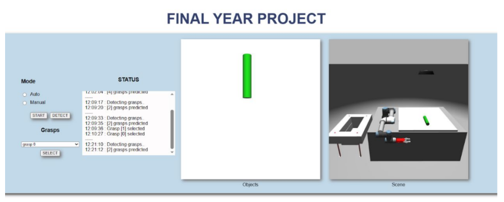
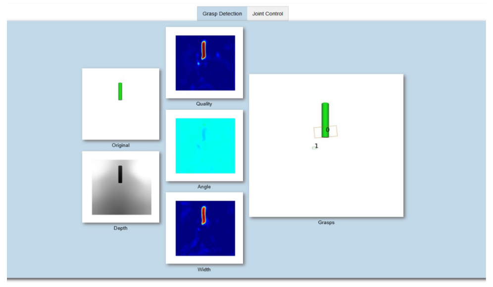

# ROS Based Robot Arm With Autonomous Object Grasping Capability

In our study, a robotic manipulation system capable of grasping objects autonomously was developed. In the system, ROS based robot arm and 2-fingered gripper were designed. The autonomous object grasping ability of the robot is realized with the help of a mono webcam camera. With the image taken from the camera, the position and orientation of the objects in space are detected and inverse kinematic input is provided. Thus, the robot performs object grasping by dynamically adapting to the objects. A web-based control interface was designed to facilitate robot control. In this way, it is aimed to increase the capabilities of robot arms for applications such as material handling, arranging, stacking etc. in industry.

***Author: Mehmet KAHRAMAN and Nasree HAYEESAMA-AE / Date 27.06.2024***

Main Requirements:
--
- Ubuntu 20.04 Focal
- ROS 1 Noetic Desktop Full
- Torch
- Flask
- OpenCV

Required ROS Packages:
--
```
sudo apt install ros-noetic-moveit
sudo apt install ros-noetic-moveit-commander
sudo apt install ros-noetic-moveit-core*
sudo apt install ros-noetic-moveit-msgs

sudo apt install ros-noetic-gazebo-ros*
sudo apt install ros-noetic-gazebo-dev
sudo apt install ros-noetic-gazebo-plugins
sudo apt install ros-noetic-gazebo-msgs

sudo apt install ros-noetic-robot-controllers*
```

Running Simulation:
--

Run Deep Learning Estimator:
```
python3 FYP_RG/run_cam.py
```

Launch ROS Backend:
```
roslaunch fyp fyp_scene.launch
rosrun fyp robot_server.py
```

Run Web Interface Server:
```
python3 fyp/flask/app.py
```

Interface Images



